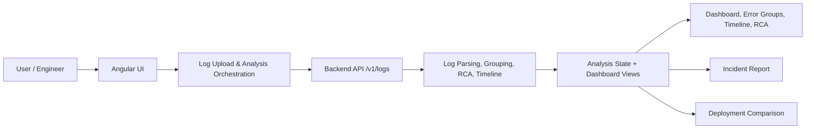
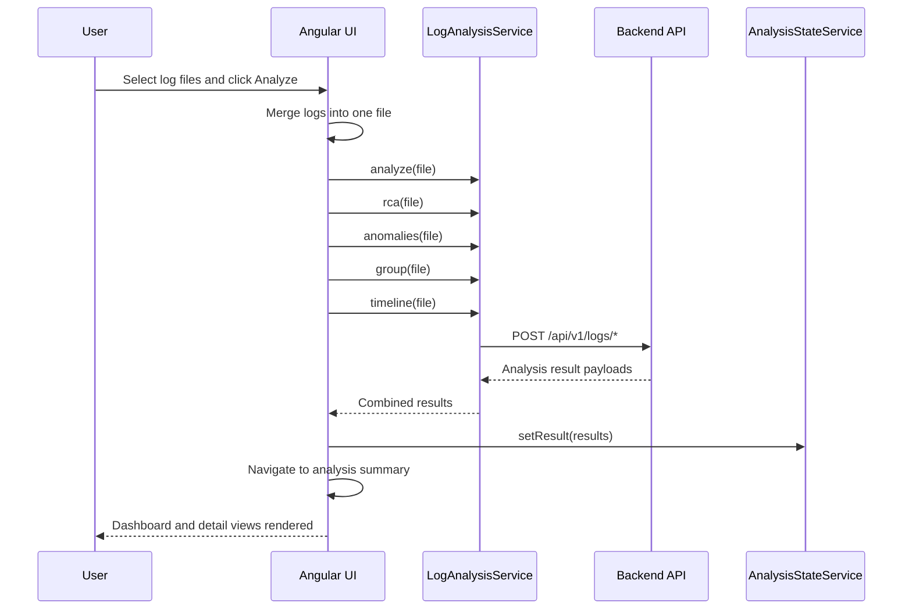
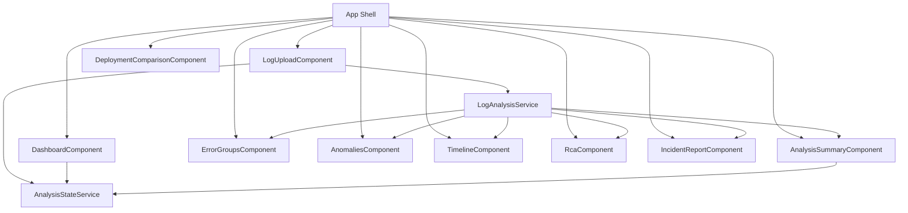
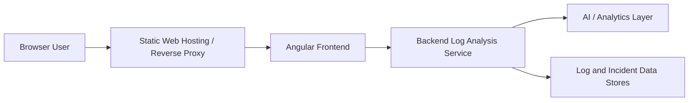

# COE Log Analyzer UI

The COE Log Analyzer UI is an Angular-based frontend for analyzing application logs, detecting anomalies, grouping errors, and producing operational insights for incident response and deployment review. It is designed to work with a backend API that processes log files and returns structured analysis results.

## Overview

This application provides a guided workflow for:

- Uploading one or more log files
- Performing event-level analysis and exception extraction
- Grouping similar errors by fingerprint
- Detecting anomalous patterns in request flows and traces
- Visualizing timeline traces and causal relationships
- Comparing deployment log sets
- Generating incident reports

The UI is built with Angular 18 and uses standalone components, HTTP-based service calls, and a shared state model to coordinate analysis results across multiple screens.

## Technology Stack

- Angular 18
- TypeScript
- RxJS
- Angular Router
- Angular HttpClient
- Standalone components
- SCSS styling

## Main Features

### Dashboard
- Displays summary metrics from the latest log analysis
- Shows total events, error counts, warning counts, and RCA confidence
- Surfaces output from the shared analysis state service

### Log upload and orchestration
- Allows users to upload one or more log files
- Merges selected files into a single upload payload
- Triggers multiple backend analysis endpoints in parallel
- Saves the combined result in shared application state

### Analysis summary
- Presents parsed event analysis and error insights from the backend
- Tracks the result set across navigation

### Error groups
- Shows grouped errors based on normalized fingerprint information
- Highlights recurring failures and their sample events

### Anomalies
- Displays anomaly detection results for traced event groups
- Supports operational review of outlier behavior

### Timeline view
- Builds a time-based trace view for matching events and root-cause indicators
- Helps correlate incidents across log sequences

### RCA and incident report
- Submits selected log files to the backend for root-cause analysis
- Generates markdown and structured incident report outputs

### Deployment comparison
- Compares two deployment log sets to identify differences and regressions

## Architecture

The frontend follows a layered structure:

1. UI layer
   - Feature components under src/app/features
   - Shared reusable UI elements under src/app/shared/components

2. Application layer
   - Routing configuration in src/app/app.routes.ts
   - App shell in src/app/app.component.html

3. Service layer
   - LogAnalysisService for log analysis API calls
   - DeploymentService for deployment comparison API calls
   - HealthService for backend health checks
   - AnalysisStateService for cross-screen result persistence

4. Data model layer
   - Interfaces under src/app/core/models for logs, results, RCA, anomalies, and deployment comparisons

### Architecture at a glance



### Upload and RCA sequence



### Component-level view



## Project Summary for Stakeholders

This project is a production-oriented monitoring and investigation UI for engineering teams. It allows users to upload operational log files, trigger backend analysis, and review root-cause findings, anomaly patterns, timeline traces, and incident reports in a single dashboard-driven workflow. The design keeps the frontend focused on interaction and presentation while the backend performs high-value log intelligence tasks.

## Project Structure

```text
src/
  app/
    app.component.*
    app.routes.ts
    core/
      models/
      services/
    features/
      dashboard/
      deployment-comparison/
      incident-report/
      log-analysis/
      rca/
    shared/
      components/
```

## API Integration

The frontend expects a backend service running at:

- http://localhost:8080/api/v1/logs
- http://localhost:8080/api/v1/health

The main log API calls include:

- POST /api/v1/logs/analyze
- POST /api/v1/logs/parse
- POST /api/v1/logs/analyze-exceptions
- POST /api/v1/logs/group
- POST /api/v1/logs/timeline
- POST /api/v1/logs/anomalies
- POST /api/v1/logs/rca
- POST /api/v1/logs/incident-report
- POST /api/v1/logs/incident-report/markdown
- POST /api/v1/logs/deployment-comparison

## Getting Started

### Prerequisites

- Node.js 18+ and npm
- Angular CLI (optional but helpful for local development)
- Backend log analysis service running locally on port 8080

### Install dependencies

```bash
npm install
```

### Run the app in development mode

```bash
npm start
```

Then open:

```text
http://localhost:4200
```

### Build for production

```bash
npm run build
```

### Run tests

```bash
npm test -- --watch=false --browsers=ChromeHeadless
```

## Environment Configuration

The application currently uses hardcoded backend URLs inside the Angular services. For multi-environment support, introduce a configuration pattern such as:

```text
src/environments/
  environment.ts
  environment.prod.ts
```

Example:

```ts
export const environment = {
  production: false,
  apiBaseUrl: 'http://localhost:8080/api/v1'
};
```

Then update the services to use `environment.apiBaseUrl` instead of literal strings, for example:

```ts
private readonly baseUrl = `${environment.apiBaseUrl}/logs`;
```

This approach allows the same frontend to run in local, test, staging, and production environments without code changes.

## Deployment Architecture



A typical deployment model:

- Frontend is served as static assets from a web server or CDN
- API requests are routed to the backend log service over HTTP
- Backend performs log parsing, grouping, anomaly detection, RCA, and incident creation
- The frontend remains lightweight and stateless aside from in-memory shared analysis state

## Notes

- The app uses a shared `AnalysisStateService` to persist the last analysis result across routes.
- File upload is handled through FormData requests using the browser `File` API.
- Many components are standalone, which keeps the app modular and reduces boilerplate.
- If the backend is unavailable, request failures are surfaced in the UI and logged to the console.

## Project Status

Status: Active frontend project in development

Current state:
- Angular frontend is implemented and routes are configured
- Core backend integrations are present for log analysis and deployment review
- Data is shared between views with a central state service
- Documentation has been updated to reflect the actual implementation

Planned improvements:
- environment configuration management
- centralized API error handling
- configurable health checks and retry logic
- broader automated test coverage

## Developer Onboarding Guide

### 1. Clone and install

```bash
git clone <repository-url>
cd coe-log-analyzer-ui
npm install
```

### 2. Start the app

```bash
npm start
```

### 3. Validate backend availability

Ensure the backend API is running at:

```text
http://localhost:8080/api/v1/health
```

### 4. Run a sample workflow

- Open the app in the browser
- Upload one or more log files
- Trigger analysis
- Review the dashboard and drill-down pages

### 5. Typical development workflow

- update a component or service
- run `npm run build` to validate compilation
- use `npm test` for unit testing
- review any API contract changes with the backend team

## Recommended Next Steps

- Add environment-based configuration for backend URLs
- Add form validation and retry logic for failed API calls
- Implement a generic loading/error state strategy across pages
- Add E2E tests for the upload and analysis workflow
- Introduce accessibility and keyboard support improvements for dashboard interactions

## Risk Matrix

| Risk | Impact | Likelihood | Mitigation |
| --- | --- | --- | --- |
| Hardcoded localhost backend URL | Medium | High | Move API URLs to environment files and config injection |
| Backend unavailable during analysis | High | Medium | Add health checks and friendly retry states |
| Sensitive log content exposed in UI | High | Medium | Mask sensitive fields and validate display rules |
| Large log files causing memory pressure | Medium | Medium | Add upload size validation and chunking strategy |
| Inconsistent error handling across screens | Medium | Medium | Centralize API error interceptors and common UX patterns |

## Glossary

- RCA: Root Cause Analysis
- Trace: A correlated set of events sharing a request or execution path
- Fingerprint: A normalized signature used to group similar errors
- Incident report: Actionable summary used for outage communication and response
- Deployment comparison: A before/after log review to detect regressions or changes

## Release Checklist

- [ ] Backend health endpoint responds successfully
- [ ] Frontend builds without errors
- [ ] Sample log upload succeeds
- [ ] Dashboard metrics render correctly
- [ ] RCA workflow returns result data
- [ ] Timeline and anomalies pages render properly
- [ ] Incident report markdown export works
- [ ] Deployment comparison works with two files
- [ ] Error states are user-friendly and consistent
- [ ] Environment configuration is validated for target deployment

## API and Service Appendix

| Service | Purpose | Typical Endpoint |
| --- | --- | --- |
| LogAnalysisService | Analyze logs, group errors, detect anomalies, timeline, RCA | /api/v1/logs |
| DeploymentService | Compare before and after deployment logs | /api/v1/logs/deployment-comparison |
| HealthService | Report system readiness | /api/v1/health |
| AnalysisStateService | Store the latest analysis results across views | In-memory shared state |


## Appendix: Key File Map

- [src/app/app.routes.ts](src/app/app.routes.ts) — route definitions
- [src/app/core/services/log-analysis.service.ts](src/app/core/services/log-analysis.service.ts) — main API orchestration
- [src/app/core/services/analysis-state.service.ts](src/app/core/services/analysis-state.service.ts) — shared result state
- [src/app/core/models/log-analysis.model.ts](src/app/core/models/log-analysis.model.ts) — log analysis types
- [src/app/features/log-analysis/log-upload/log-upload.component.ts](src/app/features/log-analysis/log-upload/log-upload.component.ts) — upload and analysis workflow
- [src/app/features/dashboard/dashboard/dashboard.component.ts](src/app/features/dashboard/dashboard/dashboard.component.ts) — summary dashboard logic
- [src/app/features/rca/rca/rca.component.ts](src/app/features/rca/rca/rca.component.ts) — RCA presentation
