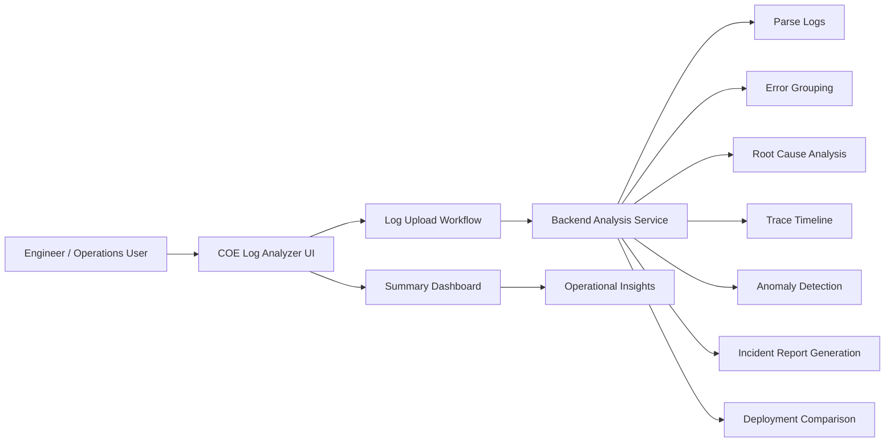
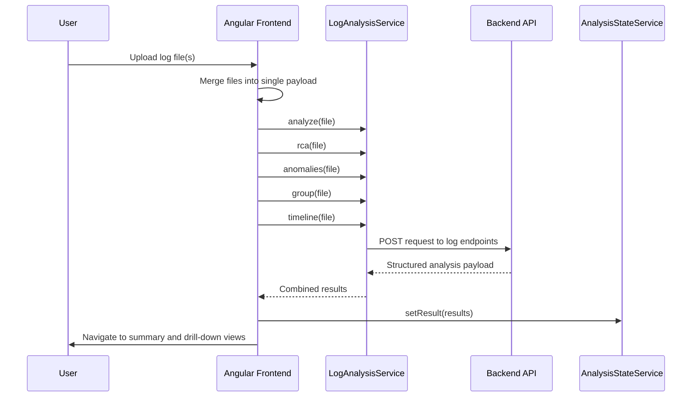
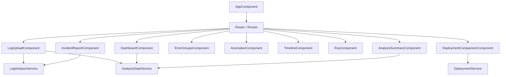
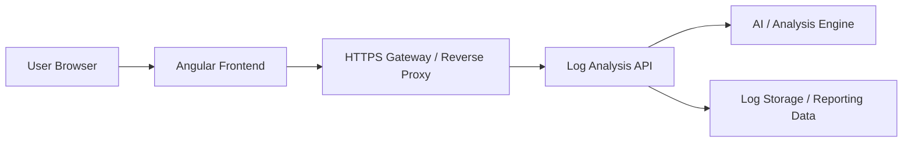

# Software Design Specification (SDS)

## 1. Document Purpose

This document describes the software design of the COE Log Analyzer UI, a frontend Angular application for ingesting log files, analyzing operational incidents, and presenting actionable intelligence to engineering teams. It captures the architecture, module responsibilities, data flow, integration points, and key design decisions used in the current implementation.

## 2. System Overview

The application helps users:

- upload logs from production or deployment environments
- trigger backend analysis for pattern detection, grouping, and RCA
- review summaries and error clusters in a web dashboard
- compare before/after deployment logs
- generate incident reports for support and outage review

The system is intentionally split into a presentation layer and a backend analysis layer. The frontend is responsible for user interaction, orchestrating API requests, and rendering derived results. The backend performs file parsing and advanced analysis logic using AI-assisted operations and log processing workflows.

## 3. Scope

### In Scope

- Angular frontend for log upload and analysis
- Route-based navigation between features
- Shared state management across screens
- Service-based communication with backend APIs
- Support for RCA, anomaly detection, timeline traces, and incident reporting
- Deployment comparison workflow

### Out of Scope

- Backend implementation details of the analysis engine
- Data persistence and database design
- Authentication and authorization
- Real-time streaming log processing
- Multi-user collaboration and audit history

## 4. Functional Requirements Summary

1. Users can upload one or more log files.
2. The system merges files into a single payload for backend submission.
3. The system can request multiple analysis operations in parallel.
4. Results are stored centrally and reused across pages.
5. Users can view summary metrics on the dashboard.
6. Users can inspect grouped error patterns and anomaly details.
7. Users can retrieve trace timelines and root cause results.
8. Users can generate incident report output in markdown or structured form.
9. Users can compare logs from two deployment stages.

## 5. Architecture Overview

The frontend follows a modular Angular architecture built around standalone components.

### High-Level Layers

- Presentation layer
  - Feature modules/components under src/app/features
  - Shared UI components under src/app/shared/components

- Application layer
  - Routing logic in src/app/app.routes.ts
  - Root app shell in src/app/app.component.*

- Service layer
  - Http-based services for backend integration
  - Shared state service for cross-page data synchronization

- Model layer
  - Interfaces and domain types under src/app/core/models

### System Context Diagram

### Upload and RCA Workflow Sequence

### Component Dependency View

## 6. Module Structure

### 6.1 Root App

The root application shell contains:

- main navigation sidebar
- top header and status indicator
- router outlet for child pages

This provides a consistent UI framework for all feature screens.

### 6.2 Dashboard

The dashboard subscribes to the shared analysis state and renders metrics such as:

- total events
- error count
- warning count
- severity percentage distribution
- RCA confidence

This view acts as a summary landing page after analysis completion.

### 6.3 Log Upload and Analysis Workflow

The log upload component is the main orchestration point. It:

- takes user-selected log files
- merges them into a single blob
- submits a combined payload to backend endpoints
- runs several related requests concurrently using RxJS `forkJoin`
- stores the returned analysis result in `AnalysisStateService`
- navigates to the summary page

This reduces effort for the user and centralizes multi-request orchestration in one place.

### 6.4 Analysis Summary

This area renders the structured results derived from backend analysis. It relies on the shared state to show the current analysis output without re-fetching data.

### 6.5 Error Groups and Anomalies

These feature pages focus on operational intelligence:

- grouped error fingerprints
- normalized message patterns
- recurrence counts and sample events
- anomaly summaries and trace-level findings

### 6.6 Timeline and RCA

These views help the user understand:

- when important events occurred
- which traces correlate to an issue
- what likely root cause was identified by analysis
- which evidence supports the result

### 6.7 Incident Report

This feature allows a user to submit a log file and generate a formal incident report, including markdown export. It is designed for quick operational documentation and sharing with teams.

### 6.8 Deployment Comparison

This feature compares two deployment snapshots using distinct before/after log files. It is used to review changes, regressions, and likely drift between releases.

## 7. Core Services

### 7.1 LogAnalysisService

Responsible for all log-processing APIs. It exposes methods such as:

- analyze(file)
- parse(file)
- analyzeExceptions(file)
- group(file)
- timeline(file)
- anomalies(file)
- rca(file)
- incidentReport(file)
- incidentReportMarkdown(file)

The service uses FormData requests and a single backend root URL:

- http://localhost:8080/api/v1/logs

### 7.2 AnalysisStateService

This shared service manages the latest analysis result in a `BehaviorSubject` and exposes it as an observable. It enables cross-page state sharing without requiring repeated backend requests.

Important responsibilities:

- setResult(result)
- getResult()
- updateResult(partial)
- clear()

### 7.3 DeploymentService

This service handles deployment comparison API requests. It submits two files, `before` and `after`, to the deployment comparison endpoint.

### 7.4 HealthService

This service checks backend health and reports application and Ollama service availability. It is useful for readiness validation.

## 8. Data Model Design

The application uses strongly typed TypeScript interfaces to model analysis output. The core models include:

- LogEvent
- LogEventAnalysis
- ErrorGroupingResult
- TimelineTrace
- AnomalyDetectionResult
- RcaAnalysisResult
- IncidentReport
- DeploymentComparison

The central aggregate type is `LogAnalysisResult`, which combines the most important outputs of the backend: events, RCA, anomalies, error groups, and timeline entries.

## 9. Data Flow

### Upload and Analysis Flow

1. User selects log files in the upload screen.
2. Files are merged into one temporary log payload.
3. Multiple analysis requests are triggered concurrently.
4. Backend returns structured results.
5. Results are saved in `AnalysisStateService`.
6. Navigation moves to the analysis summary page.
7. Other pages read the same shared result to render specialized views.

### Incident Report Flow

1. User selects a log file.
2. Frontend sends the file to the incident report endpoint.
3. Structured report is rendered in the page.
4. User may download markdown export using a second endpoint.

### Deployment Compare Flow

1. User selects before and after deployment log files.
2. Frontend posts both files to the comparison API.
3. Comparison result is rendered in a dedicated result page.

## 10. Frontend Interaction Patterns

### Routing

The app uses route-level lazy loading for feature modules and components. The main routes include:

- dashboard
- analyze
- analysis
- errors
- anomalies
- timeline
- rca
- incident-report
- deployment-comparison

### State Synchronization

Because multiple pages render different parts of one analysis result, the app uses a shared service instead of duplicate fetch logic. This keeps the application responsive and reduces redundant network calls.

### Error Handling

Each feature component handles failed API requests with user-visible error messages and console logging. This keeps the UI predictable while recording operational issues for debugging.

## 11. Security and Compliance Considerations

The current frontend is a client-side UI and does not implement authentication or authorization. The application also includes direct file upload and log inspection patterns, which means sensitive log content should be treated carefully.

Key considerations:

- avoid logging raw sensitive values in production
- mask sensitive data when displayed in UI, if backend does not already do so
- ensure backend services enforce secure transport and restricted access
- validate file types and sizes before upload

## 12. Performance Considerations

- The app uses parallel requests for related backend analyses to reduce user wait time.
- `forkJoin` is used to coordinate analyses that are logically related to the same file input.
- UI state and result caching are handled via shared service state rather than redundant fetching.

## 13. Maintainability Considerations

- Feature components are standalone and grouped by domain.
- Models are centralized under src/app/core/models.
- Service logic is separated from presentation logic.
- The route structure remains easy to extend for new operational views.

## 14. Risks and Gaps

1. Backend URL is hardcoded to localhost, which is not appropriate for multi-environment deployment.
2. No centralized environment configuration exists for API endpoints.
3. Error handling is minimal and inconsistent across screens.
4. There is no explicit authentication and role-based access model.
5. The app does not yet define a formal global loading state or API retry strategy.

## 15. Deployment Architecture and Environment Configuration

The current implementation is designed for local development and uses hardcoded localhost API endpoints in the service layer. This is acceptable for a proof of concept or single-machine setup, but it is not suitable for production-grade environment isolation.

### Target Deployment Pattern

### Configuration Strategy

The system should be updated to use environment-specific values, for example:

- local: http://localhost:8080/api/v1
- test: https://test-api.company.local/api/v1
- prod: https://api.company.com/logs/api/v1

This can be implemented using Angular environment files and a central `apiBaseUrl` property.

### Operational Considerations

- ensure TLS is enabled in non-local environments
- avoid exposing sensitive backend details in client code
- configure CORS policies on the backend for approved frontend origins
- use health checks before allowing analysis workflows

## 16. Recommended Improvements

- Introduce environment files such as `environment.ts` and `environment.prod.ts`.
- Move backend base URL configuration out of service code.
- Add centralized interceptors for error handling and loading indicators.
- Add end-to-end tests for upload, summary, RCA, and comparison workflows.
- Add accessibility improvements for keyboard navigation and screen-reader compatibility.
- Add robust file validation and rejection for unsupported file types.
- Add environment-aware deployment configuration and CI/CD validation.

## 17. Risk Register

| ID | Risk | Category | Impact | Probability | Mitigation |
| --- | --- | --- | --- | --- | --- |
| R1 | Hardcoded backend URL | Configuration | Medium | High | Externalize API endpoints into environment configuration |
| R2 | Lack of auth and authorization | Security | High | Medium | Add authentication and role-based access controls |
| R3 | Missing global error handling | Reliability | Medium | Medium | Add centralized interceptors and consistent UI messaging |
| R4 | Large uploaded files | Performance | Medium | Medium | Implement validation, size limits, and chunked upload handling |
| R5 | Sensitive log data exposure | Compliance | High | Medium | Mask or redact sensitive content before rendering |

## 18. Glossary

- Fingerprint: a normalized event signature used to group similar errors
- RCA: root cause analysis based on correlated evidence and incident patterns
- Trace: a sequence of events associated with a request or workflow execution
- Incident report: a structured summary for communication and investigation tracking
- Deployment comparison: review of before/after deployment logs to identify regressions

## 19. Release Readiness Checklist

- [ ] Application builds successfully
- [ ] Backend health check passes
- [ ] Log upload and analysis run end-to-end
- [ ] Error and anomaly views render correctly
- [ ] RCA result display is stable
- [ ] Incident report export works
- [ ] Deployment comparison pipeline is validated
- [ ] Security review completed for sensitive log handling
- [ ] Environment configuration tested for target deployment

## 20. Developer Onboarding Guide

### Setup

1. Install Node.js 18 or later.
2. Run `npm install` in the project root.
3. Start the frontend with `npm start`.
4. Validate that the backend is available on the expected host and port.

### Local validation steps

1. Ensure the health endpoint responds successfully.
2. Upload a representative log file.
3. Confirm dashboard metrics and drill-down views render.
4. Verify RCA, anomaly detection, and incident report actions work as expected.
5. Capture and review any UI or API errors before release.

### Team handoff expectations

- keep backend contract changes aligned with the API team
- verify environment configuration before production deployment
- document any custom validation rules or file constraints
- maintain test coverage for any workflow added to the UI

## 21. Appendix: Key Components and Responsibilities

| Component | Responsibility |
| --- | --- |
| AppComponent | global shell and navigation container |
| LogUploadComponent | file selection, merge, orchestration, navigation |
| DashboardComponent | summary metrics and operational highlights |
| AnalysisSummaryComponent | presents result sets from the shared state |
| ErrorGroupsComponent | grouped error patterns and sample occurrences |
| AnomaliesComponent | anomaly analysis and outlier review |
| TimelineComponent | trace and sequence visualization |
| RcaComponent | RCA result rendering |
| IncidentReportComponent | report generation and markdown export |
| DeploymentComparisonComponent | before/after deployment review |
| AnalysisStateService | central state sharing for results across routes |
| LogAnalysisService | HTTP layer for log intelligence endpoints |
| DeploymentService | HTTP layer for deployment comparison |
| HealthService | backend readiness checks |

## 22. Conclusion

The COE Log Analyzer UI is a focused operational analysis portal designed to support engineers in processing logs, identifying incidents, investigating root causes, and preparing incident communications. Its architecture is modular, service-oriented, and well suited for integration with a log intelligence backend that provides advanced analysis results. The documentation now includes both engineering guidance and enterprise-ready operational references for release, risk, deployment planning, and onboarding.
